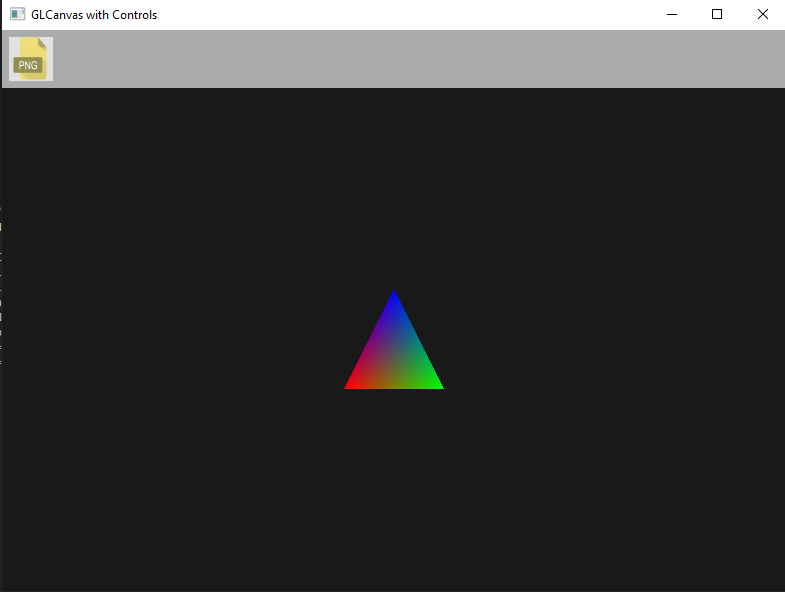
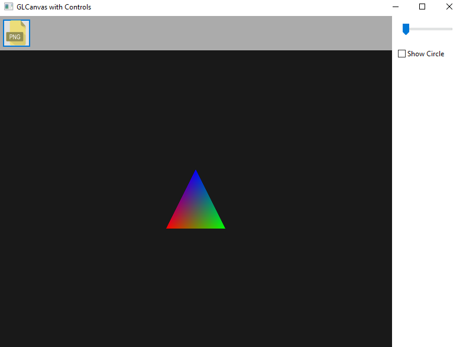
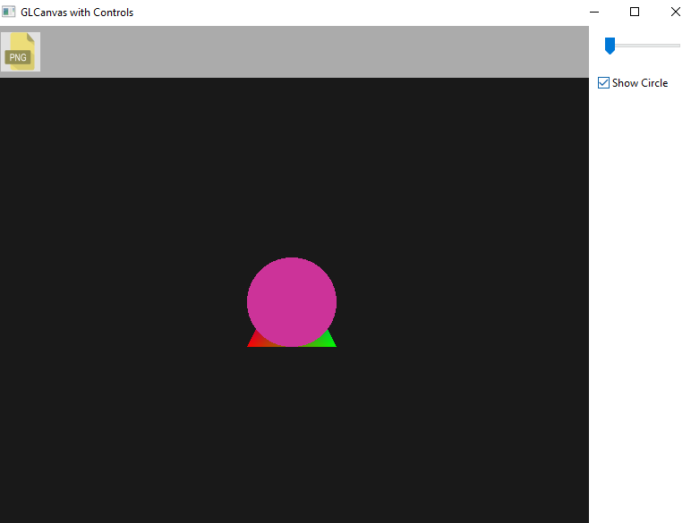
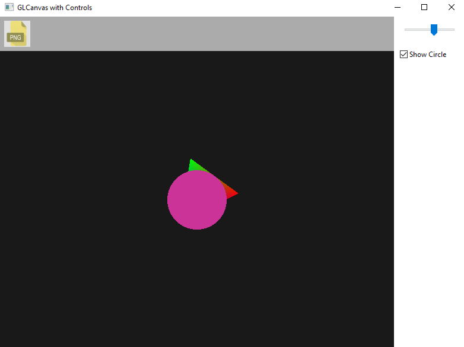
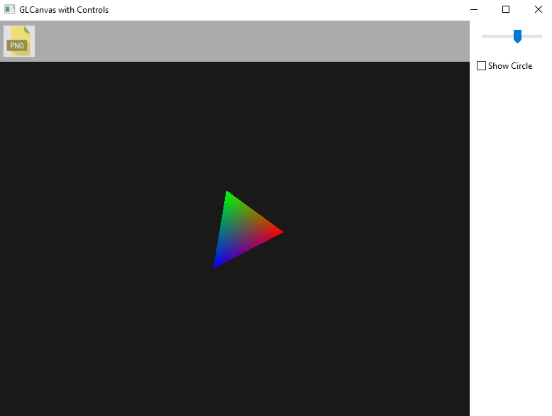

# wxWidgets OpenGL Demo Application

A simple wxWidgets + OpenGL demo project showcasing:

- Rendering colored shapes (triangle, circle)
- Loading and displaying a PNG texture as a clickable button
- Toggle visibility of a control panel with slider and checkbox
- Rotating shapes using slider input
- Cross-platform build with CMake

---

## Features

- **Custom OpenGL canvas** embedded in wxWidgets window
- Loads `icon.png` texture as an interactive button
- Panel visibility toggled by clicking the button
- Slider to control rotation angle of shapes
- Checkbox to toggle circle rendering
- Uses modern C++17 standards
- Cross-platform support: Windows, macOS, Linux (with minor adjustments)

---

## Screenshots

---

## Prerequisites

- C++17 compatible compiler (e.g., MSVC, clang, GCC)
- [wxWidgets](https://www.wxwidgets.org/) library installed
- OpenGL development headers/libraries
- [CMake](https://cmake.org/) 3.10 or higher

### Installing dependencies

#### Windows

- Install wxWidgets (prebuilt binaries or build from source)
- Install CMake and add to PATH
- Use Visual Studio (recommended) or MinGW for compiling
- Ensure OpenGL libraries come with your environment (usually included)

#### Steps to run cmake(At repo location)
- mkdir build
- cd build
- cmake ..
- cmake --build 
- .\Project.exe (or first do, cd Debug and then run)
